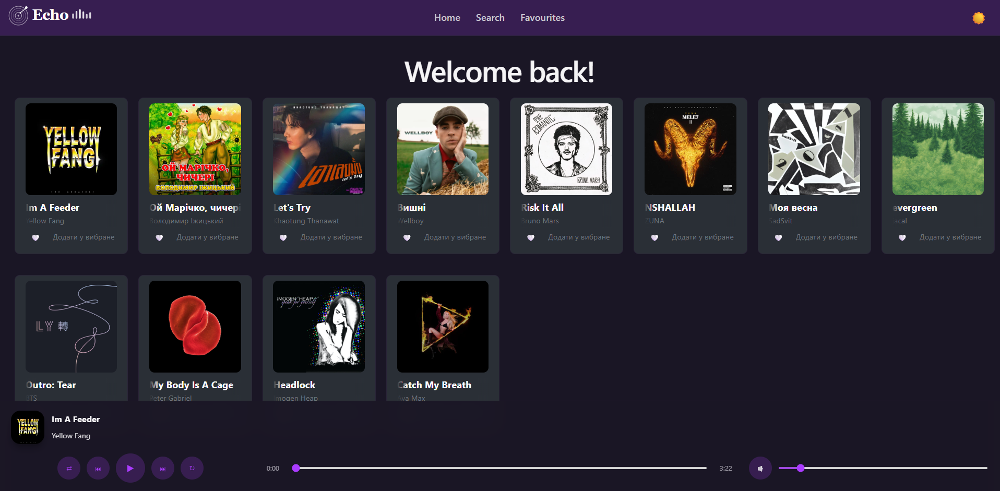

# Music Player

## Опис

Простий музичний плеєр на React із відтворенням локальних аудіотреків, додаванням до улюблених, збереженням стану програвання та зміною теми.

## Технології

- React
- Vite
- JavaScript
- CSS
- LocalStorage

## Як запустити

1. Відкрити термінал у корені проекту.
2. Виконати:
   ```bash
   npm install
   npm run dev
   ```
3. Відкрити адресу, яку покаже Vite у браузері.

## Структура проєкту

- `public/` — статичні ресурси: аудіо, зображення
- `src/` — основний код додатку
  - `src/components/` — UI-компоненти
  - `src/context/` — логіка стану плеєра
  - `src/data/` — список треків
  - `src/pages/` — сторінкові компоненти
- `package.json` — залежності та скрипти
- `vite.config.js` — налаштування Vite

## Розподіл обов'язків

- `src/context/PlayerContext.js` — управління станом плеєра, збереження в localStorage
- `src/components/PlayerBar/PlayerBar.jsx` — аудіо-панель, прогрес, гучність та керування відтворенням
- `src/components/TrackCard/TrackCard.jsx` — картка треку з можливістю відтворення та додавання до favorites
- `src/components/Navbar/Navbar.jsx` — навігація і перемикач теми
- `src/pages/Home/Home.jsx` — головна сторінка з треками
- `src/pages/Search/Search.jsx` — пошук по треках
- `src/pages/Favourites/Favourites.jsx` — сторінка улюблених треків

## Що реалізовано

- Відтворення треків, пауза, наступний/попередній трек
- Прогрес-бар із можливістю перемотування
- Регулювання гучності та mute
- Додавання/видалення треків до улюблених
- Збереження поточного треку, позиції, гучності, теми та улюблених у localStorage
- Темна/світла тема

## Що планувалось (бонус)

- Поліпшення UI та анімації
- Більш гнучка пагінація чи плейлисти
- Підтримка локального збереження історії програвання
- Додаткові ефекти при переході між треками

## Скриншоти

